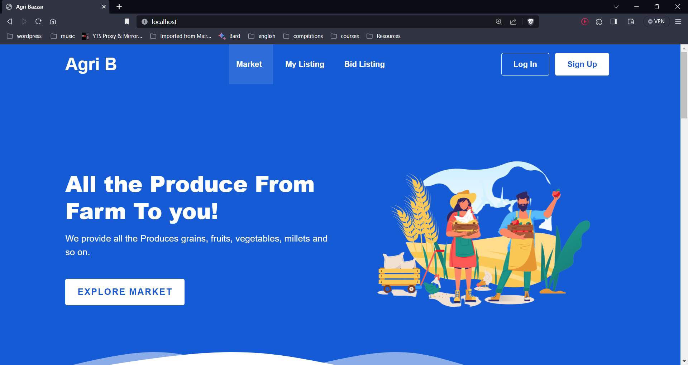

# Agri B

## Table of Contents

- [About](#about)
- [Features](#features)
- [Getting Started](#getting-started)
- [Usage](#usage)
- [Technologies Used](#technologies-used)
- [Contributing](#contributing)
- [License](#license)

## About

[Your Project Name] is a simplified produce listing system designed to connect local farmers with buyers in a seamless and efficient manner. This platform empowers farmers to showcase their fresh produce, while buyers can easily browse listings, contact sellers, and enjoy locally sourced food.

## Features

- **User-Friendly Interface**: A clean and intuitive interface makes it easy for users to browse, search, and interact with produce listings.

- **Produce Listings**: Farmers can add, edit, and manage their produce listings, specifying name, quantity available, and per-unit prices.

- **User Registration (Optional)**: Users have the option to create accounts, facilitating identification of farmers and buyers.

- **Database Simulation**: Produce listings are stored in a simulated database for data storage and retrieval.

## Getting Started

To get started with [Your Project Name], follow these steps:

1. Clone the repository: `git clone https://github.com/yourusername/your-project.git`
2. Install any necessary dependencies.
3. Configure the project, including database connections and Firebase setup (if used).
4. Run the application locally.

## Usage

- **Browse Listings**: Visit the "Produce Listings" page to explore available produce items.
- **Add Listings**: Farmers can navigate to the "Add Listing" page to add new produce listings.
- **Manage Listings**: Users can edit or remove their existing produce listings.
- **User Registration**: (Optional) Users can create accounts to access additional features.

## Technologies Used

- **Frontend**: HTML, CSS, JavaScript
- **Backend**: (Optional) PHP
- **Database**: (Optional) MySQL or Firebase Realtime Database/Firestore

## Contributing

We welcome contributions from the community! If you'd like to contribute to [Your Project Name], please follow our [contribution guidelines](CONTRIBUTING.md).

## License

This project is licensed under the [License Name] - see the [LICENSE.md](LICENSE.md) file for details.
